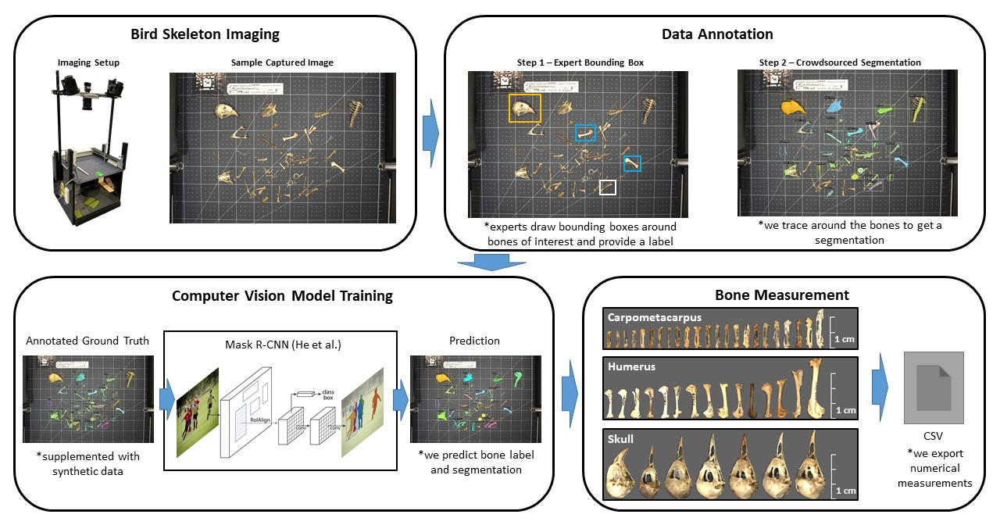

<!-- PROJECT LOGO -->
<br />
<div align="center">

  <h3 align="center">Skelevision</h3>

  <p align="center">
    A deep neural network for high throughput measurement of functional traits on museum skeletal specimens.
  </p>
</div>


<!-- TABLE OF CONTENTS -->
<details>
  <summary>Table of Contents</summary>
  <ol>
    <li>
      <a href="#about-the-project">About The Project</a>
    </li>
    <li>
      <a href="#getting-started">Getting Started</a>
      <ul>
        <li><a href="#prerequisites">Prerequisites</a></li>
        <li><a href="#installation">Installation</a></li>
      </ul>
    </li>
    <li>
      <a href="#usage">Usage</a>
      <ul>
        <li><a href="#getting-data-and-model">Getting Data and Model</a></li>
        <li><a href="#measuring-bones">Measuring Bones</a></li>
        <li><a href="#training">Training</a></li>
      </ul>
    </li>
    <li><a href="#license">License</a></li>
    <li><a href="#contact">Contact</a></li>
  </ol>
</details>





<!-- ABOUT THE PROJECT -->
## About The Project

We adapt recent deep neural network approaches in computer vision to enable high throughput measurement of functional traits on museum bird skeletal specimens. This repository provides the necessary code and links to the necessary bird skeleton images to train and test the model. For more detail, please see Weeks et al. 2022. A deep neural network for high throughput measurement of functional traits on museum skeletal specimens. _Methods in Ecology and Evolution._ 

<p align="right">(<a href="#top">back to top</a>)</p>


<!-- GETTING STARTED -->
## Getting Started

This section will guide you through installing the required dependencies and running the Skelevision model. 

### Prerequisites

We recommend creating a conda environment and installing the required prerequisites there. 

To install miniconda:

- Visit [miniconda](https://docs.conda.io/en/latest/miniconda.html) website
- Download the corresponding .sh file for your system
- Linux:
    - ```chmod +x {Miniconda3-latest-Linux-x86_64.sh}```
    - ```./ {Miniconda3-latest-Linux-x86_64.sh}```
    - ```export PATH="/home/{username}/miniconda/bin:$PATH"```
    - ```source ~/.zshrc```

Make sure to replace the file names in {} with the right ones for your installation. Verify the installation of conda by typing "conda -V" in the command prompt, which should show the conda version installed. 

Create a new conda environment:

- ```conda create --name skelevision-env python=3.8```
- ```conda activate skelevision-env```

We require the installation of the following dependencies from their respective websites:

- PyTorch (https://pytorch.org/get-started/locally/)
- Detectron2 (https://detectron2.readthedocs.io/en/latest/tutorials/install.html)

We recommend installing GPU versions of PyTorch / Detectron2.

### Installation

After installing PyTorch and Detectron2, you'll need to install a few more dependencies.

```pip install -r requirements.txt```


<p align="right">(<a href="#top">back to top</a>)</p>


<!-- USAGE EXAMPLES -->
## Usage

This section will guide you through downloading the dataset, the pretrained model, and measuring bones. 

### Getting Data and Model

The data will be available on https://skelevision.net/ or via [this link on deepblue](https://deepblue.lib.umich.edu/data/concern/data_sets/7w62f853v). Please download the data and extract the data in the /data/ such that the structure from the directory looks like this. 

The pretrained model will be available [here](https://drive.google.com/drive/folders/15So_b7EMK90vxRyfk_UQl75Ir10GAL7b?usp=sharing). Please place the model_final.pth in the following structure shown below. 

- data
    - Training_Images
        - UMMZ_22510
        - UMMZ_
    - processed_images (created after running process_data.py)
        - 22510.jpg
        - ******.jpg
- models
    - oct_2021
        - model_final.pth
- annotations
    - oct_2021_annotations.json
- README.md
- predict.py
- ...

Finally, run the script to process data:

```python process_data.py```

### Measuring Bones

After setting up the data and model folders above, we can run some predictions. 

```python predict.py -m models/oct_2021 -d data/processed_images -g -1```

The parameters to predict.py are below:

- -m [model checkpoint folder] REQURIED, folder that contains model_final.pth
- -d [image directory] REQUIRED, we will predict on all images in this directory
- -o [output directory] DEFAULT, output/
- -g [gpu] DEFAULT -1 for CPU, or GPU id
- -c [pixel to mm conversion constant] DEFAULT 0.2309mm/pixel

Do not change -c when using data provided by skelevision.net. 

### Training

To train a new model from scratch, we require 1) an annotation file in COCO format (a sample is provided in this repository) and 2) a folder of training images. To reproduce the pretrained model provided, please download the special version of the training dataset [here](https://drive.google.com/file/d/1ZaAwNMcA0dlv16LA5OJ0pDLgV9GFKuKV/view?usp=sharing) and extract it to data/oct_2021_train. The special training set contains synthetic images. After training, one can use predict.py to run the predictions on a folder of specimen images. 

Run the training script like this. 

```python train.py -a annotations/oct_2021_train_annotation.json -d data/oct_2021_train -g 0```

The parameters to train.py are below:

- -a [annotation file] REQURIED, provided annotation file (or custom one)
- -d [image directory] REQUIRED, directory of training images
- -o [output directory] DEFAULT models/train, directory for model checkpoints
- -g [gpu] DEFAULT 0, GPU id (cpu not recommended for training)
- -i [iteration] DEFAULT 40000, training iterations (for debugging 6k is ok)

<p align="right">(<a href="#top">back to top</a>)</p>


<!-- LICENSE -->
## License

[skelevision.net](https://skelevision.net/)

<p align="right">(<a href="#top">back to top</a>)</p>


<!-- CONTACT -->
## Contact

[skelevision.net](https://skelevision.net/)

<p align="right">(<a href="#top">back to top</a>)</p>


Create with [README Page Template](https://github.com/othneildrew/Best-README-Template/blob/master/README.md)


<!-- MARKDOWN LINKS & IMAGES -->
<!-- https://www.markdownguide.org/basic-syntax/#reference-style-links -->
[contributors-shield]: https://img.shields.io/github/contributors/othneildrew/Best-README-Template.svg?style=for-the-badge
[contributors-url]: https://github.com/shadowninjazx/skelevision/graphs/contributors
[forks-shield]: https://img.shields.io/github/forks/othneildrew/Best-README-Template.svg?style=for-the-badge
[forks-url]: https://github.com/shadowninjazx/skelevision/network/members
[stars-shield]: https://img.shields.io/github/stars/othneildrew/Best-README-Template.svg?style=for-the-badge
[stars-url]: https://github.com/shadowninjazx/skelevision/stargazers
[issues-shield]: https://img.shields.io/github/issues/othneildrew/Best-README-Template.svg?style=for-the-badge
[issues-url]: https://github.com/shadowninjazx/skelevision/issues
[product-screenshot]: images/screenshot.png
